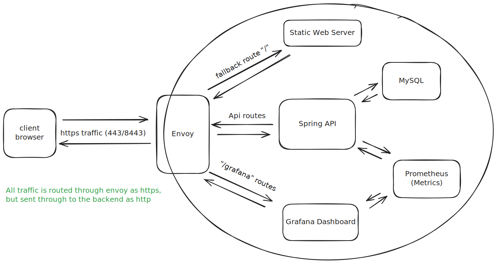

# E-CommerceCloudMigration (Archived)
Demo E-Commerce Site, Added New Features, and Cloud Migration using:
- Kubernetes (Minikube)
- Docker
- Helm
- Envoy with Https
- Custom Static Web Service
- MySQL
- Spring REST API
- Grafana Dashboard
- Prometheus


### Final Note:
This entire project was created start-to-finish in 5 days with no prior knowledge/planning, the requirements of the final were to implement bug fixes in the java code but I decided to migrate it to a cloud deployment in minikube within those few days (as the bug fixes and new features asked only took one).

There are many improvements I plan to make in my next project/demo, but as for this one it is finished with no plans to maintain or continue development, and now serves soley as a memory/milestone in my learning path

# 🛠️ Prerequisites: Install Required Tools

Before getting started, make sure you have the following tools installed on your Linux system:

- **[OpenSSL](https://www.openssl.org/source/)**
- **[Helm](https://helm.sh/docs/intro/install/)**
- **[Minikube](https://minikube.sigs.k8s.io/docs/start/)**
- **[kubectl (Kubernetes CLI)](https://kubernetes.io/docs/tasks/tools/#kubectl)**
- 
# Other Solutions Use in Project
- **[Kubernetes](https://kubernetes.io/)**
- **[Helm](https://helm.sh/)**
- **[Minikube](https://minikube.sigs.k8s.io/docs/)**
- **[Envoy Proxy](https://www.envoyproxy.io/)**
- **[Grafana Dashboard (Visualization)](https://grafana.com/grafana/)**
- **[Prometheus (Metrics)](https://prometheus.io/)**
  
Follow the official installation guides linked above for the most up-to-date instructions.
# 🚀  Launch
## 🔐 Generating Keys for Helm Chart (DEMO ONLY)

Before deploying, you need to generate the TLS certificates and keys required by the Helm chart.
This is for demo purposes only and should not be replicated in production, but allows me to test setting up envoy's https all the same

### 1. CD Into Certs
local to the Project Dir
```bash
mkdir ./easy-helm-deployment/charts/easy-core/charts/envoy/certs
cd ./easy-helm-deployment/charts/easy-core/charts/envoy/certs
```

### 2. Generate a self-signed TLS certificate and key using `openssl`:

```bash
openssl req -x509 -nodes -days 365 -newkey rsa:2048 \
  -keyout tls.key \
  -out tls.crt \
  -subj "/CN=localhost/O=local"
```

### 3. Generate a self-signed Chain:

```bash
cat tls.crt tls.crt > tls.chain.crt
```

### 🎉 Success!

If all steps completed without errors, you should be able to move on to Startup!


## 🔌 Startup (Minikube Demo)

Follow these steps to run the demo locally using [Minikube](https://minikube.sigs.k8s.io/).

---

### 1. Start Minikube with Registry Enabled

```bash
# start minikube
minikube start --driver=kvm2 #(KVM Optional I prefer it)
# enable minikube registry
minikube addons enable registry
```
### 2. Build API and SPA Images in Minikube Docker Environment

To build and push the images directly to Minikube's internal Docker registry, run:

```bash
eval $(minikube -p minikube docker-env) && \
docker build -t easy-api-service:latest ./EasyAPI && \
docker build -t easy-spa-service:latest ./FrontEnd
```
### 5. Upgrade or Install the Helm Chart

To deploy changes or upgrade an existing release without uninstalling, use:

```bash
helm upgrade --install easy-deployment ./easy-helm-deployment
```

### 4. Check All Pods
Wait a few moments and run:
```bash
kubectl get pods
```

You should see something like:
```bash
NAME                                READY   STATUS    RESTARTS   AGE
easy-api-service-...              1/1     Running   0          54s
easy-spa-service-...              1/1     Running   0          54s
envoy-...                         1/1     Running   0          54s
mysql-...                         1/1     Running   0          54s
grafana-...                       1/1     Running   0          26s
prometheus-...                    1/1     Running   0          54s
```

Sometimes mysql takes longer to lauch but something is wrong if its frozen for more than a minute or so

### 5. Port Forward HTTPS via Envoy

Forward Envoy’s HTTPS port to `localhost:443` so you can access the app in your browser:

```bash
sudo -E kubectl port-forward svc/envoy 443:443
sudo -E kubectl port-forward svc/envoy 8443:443
```
### 🎉 Success!

If all steps completed without errors, you should be able to open your browser and reach the demo at: [localhost](https://localhost/)

# 🗑️ Cleanup

When you're done with the demo, you can delete your Minikube cluster and purge all related data.

## Delete Minikube Cluster
```bash
minikube delete
```
## Wipe Minikube Cluster
```bash
minikube delete --all --purge
```

# Grafana
## Configure Prometheus
Goto Datasources
Add Prometheus
Url: Http://prometheus:9090
Save and test
